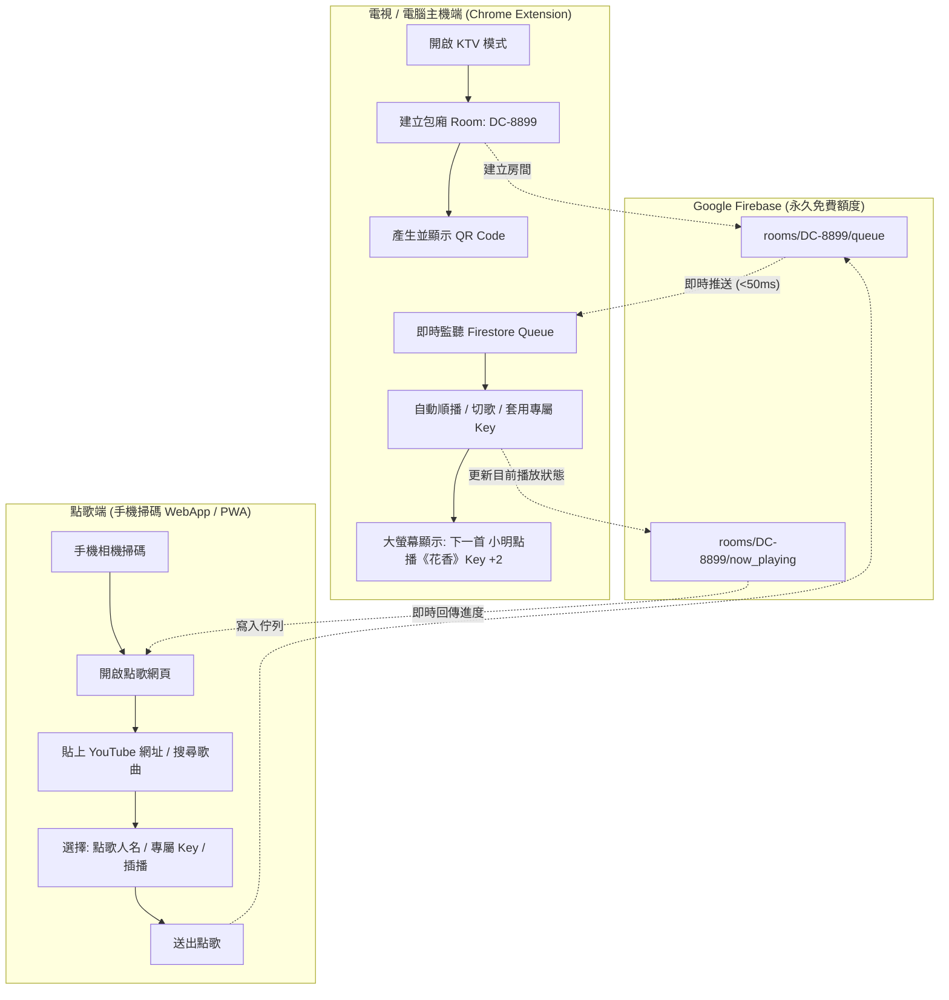

# Karaoke Kaiju KTV 包廂掃碼點歌系統規格書 (KTV Room & Shared Queue Spec)

## 1. 系統願景與設計目標

### 1.1 使用情境
在家庭聚會、朋友歡唱或 KTV 派對時：
1. **電視 / 主機端（Chrome 擴充功能）**：將電腦連接大螢幕電視，開啟「KTV 大螢幕同歡模式」，畫面上顯示專屬包廂 QR Code（例如 `diaochang.app/room/DC-8899`）。
2. **手機 / 點歌端（免安裝 WebApp / PWA）**：所有人拿起自己的 iPhone 或 Android 手機掃描螢幕上的 QR Code，立即進入專屬點歌網頁。
3. **個人化預設點歌**：使用者點歌時可直接指定自己的偏好設定（例如「點歌人：小美」、「Key：+2」、「速度：1.0x」），甚至直接從個人的「歷史練唱記錄」一鍵送出。
4. **自動排播與順暢歡唱**：電視端擴充功能收到點歌後，自動排入待播佇列（Queue），目前歌曲結束後自動切換至下一首，並自動套用該點歌人的專屬 Key 與速度，免去每首歌手動重調的麻煩。

---

## 2. 零伺服器維護成本 (Serverless) 架構方案

為了達成 **「開發者零伺服器維護負擔、零主機費用、使用者免註冊」** 的目標，評估採用以下基於 Google 免費生態的架構：



### 2.1 方案比較與選型

| 方案 | 實作方式 | 維護成本 | 連線延遲 | 適用性評估 |
| :--- | :--- | :--- | :--- | :--- |
| **方案 A (推薦·首選)**<br>**Google Firebase (Firestore + Hosting)** | 使用 Google Firebase 免費方案，擴充功能與手機端透過 Firestore SDK 雙向即時監聽。 | **$0 / 月**<br>(1GB 儲存、50,000 次讀寫/日，可支援數千場聚會) | **< 50 ms**<br>(極速即時) | ⭐⭐⭐⭐⭐ **最優解**<br>Google 生態系相容度極高，支援離線快取、自動逾期清理。 |
| **方案 B**<br>**WebRTC P2P 直連 (PeerJS)** | 手機與主機直接建立 P2P WebRTC DataChannel 連線傳遞點歌 JSON 指令。 | **$0 / 月** | **< 20 ms** | ⭐⭐⭐⭐ **次選**<br>完全無資料庫，但受限於部分 NAT/防火牆環境需要 STUN/TURN。 |
| **方案 C**<br>**Google Apps Script (GAS)** | 透過 Google 表單 / Google Sheets 作為簡易後台 API。 | **$0 / 月** | **1 ~ 3 秒** | ⭐⭐ **不推薦**<br>延遲較高，無即時 WebSocket 推送，使用者體驗卡頓。 |

---

## 3. 資料結構設計 (Schema Specification)

### 3.1 包廂房間 (`rooms/{roomId}`)
```typescript
interface KtvRoom {
  id: string;              // 例如 "DC-8899"
  createdAt: number;       // 房間建立時間戳記
  expiresAt: number;       // 房間逾期時間 (預設 8 小時後自動清理)
  hostName: string;        // 主機名稱 (例如 "客廳大電視")
  passcode?: string;       // 選用包廂密碼
  settings: {
    allowCutIn: boolean;   // 是否允許插播
    maxQueuePerUser: number; // 每人最多連續點歌數 (預設 5 首)
  };
}
```

### 3.2 待播歌曲項目 (`rooms/{roomId}/queue/{trackId}`)
```typescript
interface KtvQueueTrack {
  id: string;              // 唯一 ID
  url: string;             // YouTube 歌曲網址 (例如 https://www.youtube.com/watch?v=...)
  videoId: string;         // YouTube 影片 ID
  title: string;           // 歌曲名稱
  artist: string;          // 歌手名稱
  duration: number;        // 歌曲秒數
  
  // 點歌人與個人化調唱設定 (免手動調音)
  requesterName: string;   // 點歌人姓名/暱稱 (例如 "小明")
  preset: {
    pitchSemitones: number; // 專屬 Key (例如 +2 或 -3)
    pitchCents: number;     // 專屬 cents 微調
    speed: number;          // 播放速度 (例如 1.0)
    naturalVoice: boolean;  // 是否啟用自然人聲共振峰修正
  };

  // 佇列控制
  priority: number;        // 排序權重 (一般點歌依時間遞增，插播設為目前頂端)
  status: 'waiting' | 'playing' | 'played' | 'skipped';
  requestedAt: number;     // 點歌時間
}
```

---

## 4. 關鍵流程與互動機制

### 4.1 主機開啟包廂與 QR Code 生成
1. 主機端在擴充功能設定或歌詞頁面點擊 **「開啟 KTV 歡唱包廂」**。
2. 擴充功能隨機產生一組 6 位代碼（如 `DC-8899`），並在畫面上以浮層或角落顯示 QR Code。
3. QR Code 內容為：`https://diaochang.web.app/?room=DC-8899`。

### 4.2 手機端點歌體驗
1. 訪客手機掃描 QR Code 後直接開啟極簡響應式點歌頁面（支援 PWA 加到主畫面）。
2. 手機端提供：
   - **YouTube 連結貼上**：直接貼上任何 YouTube / YouTube Music 網址。
   - **快速調性選擇器**：點歌時一併設定好自己的 Key（如 `-2`、`+0`、`+3`）。
   - **點歌人暱稱記憶**：手機瀏覽器自動記住點歌人姓名。
   - **已點清單即時查看**：所有人都能在手機上看到目前排隊順序、目前誰在唱。

### 4.3 主機端大螢幕提示與無縫接歌
1. 主機端 Extension 透過即時監聽，當前首歌曲播放至剩餘 10 秒時，大螢幕右上角浮現提示：
   > 🎤 **下一首即將播放**：《花香》｜ 點歌人：**小明**（Key: **+2**）
2. 歌曲結束時，主機端自動觸發分頁換歌，並自動將音訊處理器的 Key 調整為 `+2`，達到完全自動化。

---

## 5. 開發進度里程碑 (Milestones)

- [x] **Phase 1~4: 核心音訊引擎與十二平均律移調**
- [x] **Phase 5A~5E: 雙行 KTV 動態歌詞、底部 1/3 欄位、逐句點播即唱、離線繁簡轉換**
- [x] **Phase 5F: KTV 劇院級大螢幕模式視覺與防衝突快捷鍵**
- [x] **Phase 6: Chrome Web Store 上架準備、隱私政策、使用者手冊與展示官網**
- [ ] **Phase 7A (即將推進): KTV 包廂資料通訊規格與主機端佇列擴充**
- [ ] **Phase 7B: 手機端掃碼點歌 WebApp (PWA) 實作**
- [ ] **Phase 7C: 主機端 QR Code 生成與 Firebase / P2P 即時同步連線**
- [ ] **Phase 7D: 大螢幕點播 HUD 提示與手機端遠端遙控器 (切歌/暫停/調 Key)**
- [ ] **Phase 8: 進階等化器 (Equalizer) 與人聲消除 (Vocal Reducer) 模組**
