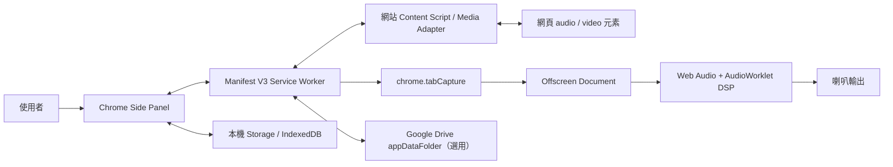

# 產品需求與驗收規格

- 文件版本：1.2（版本 0.1.0 公開／開發分流基線）
- 日期：2026-08-18
- 目前階段：Phase 1–5B 的核心 UI、歌單、歌詞工作台與 KTV 覆蓋已交付；0.1.0 公開版只開放已驗收核心功能，BPM、進階音訊與外部服務留在開發建置研究／驗證
- 產品名稱：Karaoke Kaiju

## 1. 專案目的

讓使用者在 YouTube 或其他支援的網頁媒體上練唱時，不必下載或重新上傳音樂，就能從 Chrome 側邊控制面板快速完成：

- 升降 Key，且不改變播放速度。
- 加快或放慢速度，且不改變音高。
- 設定 A、B 點，重複練習困難段落。
- 將歌曲、練習設定、循環片段與歌詞整理成多個播放清單。
- 選擇性地用自己的 Google 帳號同步資料，不由開發者架設雲端資料庫。
- 提供像 KTV 一樣提前顯示、逐句或逐字變色的歌詞。
- 更後期研究在裝置端降低主唱人聲，形成較適合練唱的伴奏。

一句話產品定位：**打開歌曲、按一下擴充功能，就能立刻用適合自己嗓音的 Key 練唱。**

## 2. 產品成功標準

產品不是以「功能很多」為成功，而是以下結果同時成立：

1. 新使用者不看說明，也能在 30 秒內完成第一次升降 Key。
2. Key 與速度能各自調整，兩者不互相綁定。
3. 使用者能在 10 秒內設好 A–B 循環並開始反覆練習。
4. 音訊處理不產生雙重聲音、明顯爆音、持續斷音或長時間音畫漂移。
5. 基本音訊功能不要求登入；只有同步播放清單與歌詞時才要求 Google 授權。
6. 音樂、影片與歌詞不會上傳到開發者擁有的伺服器。
7. 權限使用符合 Chrome Web Store 的最小權限原則。

## 3. 目標使用者與主要情境

### 3.1 主要使用者

- 想找出適合自己音域 Key 的歌手或一般練唱者。
- 需要把困難樂句放慢、重複練習的人。
- 使用 YouTube 等網頁音樂服務練習的音樂學習者。
- 想整理不同用途歌單，例如「比賽歌曲」、「每週練習」、「低音練習」的人。

### 3.2 核心使用流程

1. 使用者開啟 YouTube 歌曲。
2. 點擊擴充功能，Chrome 側邊面板打開。
3. 面板辨識目前分頁與媒體，使用者按下「開始音訊處理」。
4. 使用 `− / +` 或刻度滑桿，把 Key 調到適合自己的半音數。
5. 視需要調整速度。
6. 播放到某處時按 A，再到結尾處按 B，啟用重複練習。
7. 後續可以把歌曲與目前設定存到練習播放清單。
8. 有歌詞時切到歌詞頁，查看或校正同步時間。

## 4. 參考產品研究摘要

參考產品為 [Transpose.Video](https://transpose.video/zh-tw/#pricing) 與其 [Chrome Web Store 頁面](https://chromewebstore.google.com/detail/transpose-%E2%96%B2%E2%96%BC-pitch-%E2%96%B9-spee/ioimlbgefgadofblnajllknopjboejda?hl=zh-TW)。2026-08-16 觀察到的功能包括：

- 音高偏移 ±12 半音及微調。
- 速度 25%–400%。
- 無限循環、標記與段落跳轉。
- YouTube、Spotify、SoundCloud、Apple Music、Deezer、Vimeo、Tidal 與本機 MP3/MP4 等平台宣稱支援。
- 進階版包含低延遲音高偏移、共振峰控制、人聲消減、可拖曳時間軸標記、片段序列、工作區與雲端同步。

本專案只把它當成功能與流程標竿；不複製其名稱、品牌、圖示、程式碼、文案或畫面資產。

## 5. 範圍與分期

### Phase 0：技術可行性原型

目的：在正式做 UI 與帳號功能前，先證明最困難的音訊路徑可行。

- Chrome Manifest V3 空殼。
- YouTube 單一分頁。
- 使用者手勢啟動分頁音訊擷取。
- 即時 `−12` 到 `+12` 半音移調。
- 速度與 Key 獨立控制的最小原型。
- 最簡單 A–B 循環。
- 量測延遲、音畫同步、CPU、斷音與音質。

Phase 0 通過後才開始正式產品開發。

### Phase 1：升降 Key

- 範圍：`−12` 到 `+12` 半音，步進 1 半音。
- 一鍵重設為 0。
- 進階區提供 `−100` 到 `+100` cents 微調，步進 1 cent。
- Key 改變時，播放速度保持不變。
- 每一格為十二平均律的一個半音，倍率為 `2^(semitones/12)`；例如 C 的 `+1` 是 C♯／D♭，`+2` 是 D。
- 預設使用共振峰修正的「自然人聲」模式，降低升 Key 的尖細感與降 Key 的低沉感；仍保留低運算量的「標準」模式供比較。
- 顯示目前偏移量，例如 `−2 semitones`。
- 若使用者自行填入原調，才顯示「原調 → 目標調」；第一版不承諾自動偵測歌曲調性。

### Phase 2：速度調整

- 功能範圍：25%–400%。
- 常用精細區：50%–150%，步進 5%。
- 常用快捷：`0.5×`、`0.75×`、`1.0×`、`1.25×`、`1.5×`。
- 一鍵重設為 `1.0×`。
- 調整速度時保留目前 Key。
- 50%–150% 為主要音質驗收區；極端速度可用，但允許較明顯音質下降。

### Phase 3：A–B 重複練習

- 以目前播放時間設定 A 點與 B 點。
- 顯示 `A 時間`、`B 時間`、段落長度與循環狀態。
- 可開啟／暫停循環、清除 A/B、各自重新設定。
- 可在時間軸拖曳 A/B 標記。
- 支援鍵盤快捷鍵，但快捷鍵必須可在設定中修改或關閉。
- B 必須晚於 A；最短循環暫定 0.5 秒。
- 每首歌可儲存多個命名片段，例如「主歌」、「副歌高音」。

### Phase 4：播放清單與 Google 同步

- 一位使用者可以建立、改名、排序、刪除多個播放清單。
- 同一首歌可以出現在多個播放清單。
- 每首歌可儲存 URL、平台、標題、縮圖 URL、Key、速度、A/B 片段與備註。
- 未登入時仍能使用本機播放清單。
- 使用者主動選擇「用 Google 同步」後，才把歌單寫入目前 Chrome Sync 帳號的 `chrome.storage.sync`；不自動上傳。
- 第一階段不開啟 Google OAuth，也不建立開發者自有帳號資料庫；超過約 100 KB 的歌詞資料才評估使用 Drive `appDataFolder`。
- 離線時使用本機快取；重新連線後再同步。
- 第一階段以整個 library 的 `updatedAt` 做 newest-wins；複雜的逐筆衝突與復原介面列為後續工作。

#### 0.0.4 已交付範圍

- 可建立、改名、刪除多個本機歌單。
- 可把目前歌曲加入任一歌單，並保存 URL、平台、標題、作者、Key、cents、速度與 A–B 設定。
- 同一 URL 再加入同一歌單時會更新練習設定，不建立重複項目。
- 資料使用具 `schemaVersion` 的 `chrome.storage.local` 格式；不需登入，也不傳到開發者伺服器。
- 尚未交付：拖曳排序、備註、JSON 匯出、Google OAuth／Drive 同步與衝突處理。

#### 0.0.5 已交付範圍

- 點歌改為更新目前練唱分頁，不再建立新分頁；Side Panel 與主要控制維持開啟。
- 新頁媒體就緒後，自動套用該歌曲保存的 Key、cents、速度與 A–B preset。
- 「依序播放」在歌曲 ended 後自動前往下一首；另提供「單曲循環」與上一首／下一首控制。
- YouTube URL 儲存時移除 `list`／radio 參數，避免 YouTube 自有佇列與 Karaoke Kaiju 歌單互相競爭。
- Google 連動第一版使用 `chrome.storage.sync` 與目前 Chrome Sync 帳號；無需 OAuth client 或開發者伺服器。
- 同步資料以 UTF-8 JSON、base64 與 7000 字元 chunks 儲存，符合每 item 約 8 KB 限制；介面顯示 100 KB 配額用量。
- 未交付：拖曳排序、備註、JSON 匯出、超過 100 KB 後的 Drive `appDataFolder`、複雜離線衝突 UI。

#### 0.0.6 已交付範圍

- 練唱主畫面拆成 Key、Fine Pitch、速度、A–B 與傳輸控制五個清楚模組；Key 仍是第一操作焦點。
- 新增「最近」資料庫，偵測歌曲後自動保存 URL、平台、標題、作者、Key、cents、速度與 A–B，最多保留 50 首並以 URL 去重。
- 最近歌曲可直接在目前練唱分頁播放、套用保存 preset、移除或加入任何歌單；不開新視窗。
- 設定加入自動保存歷史、跳轉 5／10／15 秒、cents／Hz 顯示、±6／±12 Key 範圍、A4 432／440／442 Hz、鍵盤快捷鍵與可見控制模組。
- 支援繁體中文、英文、日文、簡體中文；語言切換立即生效並保存，Chrome manifest 也使用四套 `_locales`。
- Equalizer 與 Vocal Reducer 只以「後續階段」標籤呈現，未實作前不可操作或宣稱完成。
- 尚未交付：歌單拖曳排序、備註、JSON 匯出、歌詞、EQ、人聲降低、MIDI、本機檔案與 Drive 大容量同步。

### Phase 5：歌詞

#### 0.0.7 已交付範圍

- 逐行 LRC 與 Enhanced LRC 匯入、時間排序、檔案 offset 與歌曲 URL 綁定。
- YouTube 下三分之一雙行顯示：目前句與下一句交替使用左上／右下，白字為底、系統藍由左至右填色。
- 有逐字時間時按字詞長度與時間推進；一般 LRC 依目前句起訖時間做平滑句內進度。
- 歌詞顯示開關與 ±0.5 秒整體 offset；重新整理或 YouTube SPA 切歌後自動依 canonical video URL 恢復。
- 選用 Groq `whisper-large-v3` 取得 segment／word timestamps。API Key 不落盤，音檔只在明確按下產生且勾選同意後上傳。
- 《花香》頁面提供使用者指定的 LRC 參考頁捷徑；擴充功能不抓取、不內建、不散布第三方完整歌詞。
- 尚未交付：純文字手動打拍、逐句編輯器、SRT／VTT、字級與遮罩自訂、Drive `appDataFolder` 跨電腦同步。

#### 0.0.8 已交付範圍

- 歌詞 offset 增加 ±0.1 秒細調，保留 ±0.5 秒快速移動與一鍵歸零。
- 字體可在 80–140%、遮罩透明度可在 20–90% 調整，歌詞框可上下移動；設定綁定歌曲保存。
- 歌詞頁加入播放／暫停、前後跳轉、A／B 點、循環與清除的精簡控制板。
- 使用者主動開啟 Google 個人同步後，歌詞、時間校正與顯示設定和歌單一起寫入 `chrome.storage.sync`；不建立一般 Drive 檔案或開發者後端。
- 同步 codec 以 UTF-8 base64 分塊、checksum 與 newest-wins 合併處理 Unicode 歌詞及跨裝置更新；本機副本永遠保留。
- Groq `whisper-large-v3` 真實連線以原創中文測試音訊驗證成功，取得 segment 與 word timestamps；實際歌唱辨識仍需人工 offset 或後續逐句編輯。
- 尚未交付：純文字手動打拍、逐句編輯器、SRT／VTT、拖曳式影片內定位與 Drive `appDataFolder` 大容量同步。

#### 0.0.9 已交付範圍

- 在已啟動 tab capture 的 YouTube／YouTube Music 分頁，以 `MediaRecorder` 直接錄製原始分頁音訊，不要求使用者另找本機檔案。
- 錄製前暫存媒體狀態，改為原速、取消 A–B、從 0 秒播放並避免歌單自動跳下一首；完成或取消後恢復速度、循環、位置與播放狀態。
- 64 kbps Opus 即時錄製，單次最長 15 分鐘並在 25 MB 前拒絕上傳；錄完後才以使用者臨時輸入的 Key 呼叫 Groq。
- 歌詞頁顯示直接分頁入口、錄製進度、啟動音訊提示、取消按鈕與本機音訊備用路徑。
- 尚未交付：背景持久工作佇列；錄製期間需保持側邊面板與歌曲分頁開啟。

#### 5A：匯入與儲存

- 支援逐行時間碼 `.lrc` 與 Enhanced LRC；純文字 `.txt` 必須本身含 LRC 時間碼。
- 後續評估無時間碼純文字打拍與 `.srt`、`.vtt`。
- 歌詞綁定到歌曲資料並存於本機；開啟個人同步時先使用 Chrome Sync，容量超過約 100 KB 的長期方案再評估 Drive `appDataFolder`。
- 純文字歌詞不會假裝具有自動同步時間；提供手動按拍或逐句設定時間。

#### 5B：KTV 顯示

- 當前句與下一句顯示兩行，依句序交替左上／右下。
- 下一句在演唱前提前出現；提前量可調，預設暫定 1.5 秒。
- 有逐字時間資料時依 word timestamps 填色；只有逐句時間時明確使用句內線性估算。
- 歌詞頁可調整字級、背景遮罩透明度、上下位置與整體時間 offset；逐句對齊與提前量仍列入後續編輯器。
- 先支援使用者自行提供的歌詞，不主動抓取或散布受著作權保護的歌詞。

### Phase 6：去人聲／伴奏模式

#### 6A：即時中央聲道消減

- 使用 Mid/Side 或左右聲道相減降低置中的人聲。
- 優點是低延遲、可即時處理。
- 限制是會一併削弱置中的鼓、貝斯或其他樂器，也無法處理偏左／偏右或強殘響人聲。
- UI 必須稱為「人聲降低」，不能承諾「完全去人聲」。

#### 6B：本機 AI 分軌研究

- 評估 ONNX Runtime Web + WebGPU 的裝置端推論。
- 優先研究非即時、分段預處理，不先承諾直播式 AI 分離。
- 模型、權重、記憶體、下載大小、Chrome 商店政策與裝置相容性都必須經過獨立可行性驗證。
- 不把音訊上傳到開發者伺服器。

## 6. 第一版不做的事

- 不下載、破解、重新託管或轉存 YouTube／串流平台媒體。
- 不繞過 DRM、付費牆或平台限制。
- 不保證所有網站都能控制；每個平台需通過相容性測試後才列為正式支援。
- 不在 MVP 自動辨識原調、和弦或歌詞。
- 不在 MVP 自動從網路抓歌詞。
- 不在 MVP 做 AI 去人聲。
- 不做手機 Chrome；第一個發行目標是桌面版 Chrome。

## 7. 控制面板設計

### 7.1 介面形式

採用 Chrome Side Panel，而不是只用小型 popup。理由是：面板能在使用者播放、拖曳時間、反覆練習時保持開啟，也能容納播放清單與歌詞。

- 建議寬度：360–420 px。
- 導覽分成「練習」、「最近」、「歌單」、「歌詞」四頁。
- 最常用的 Key 控制永遠放在練習頁第一區。
- 進階選項預設收合，避免第一次使用時資訊過多。

### 7.2 低擬真線框

```text
┌─────────────────────────────────┐
│  歌曲標題                  ● 已連線 │
│  YouTube · 01:22 / 03:30          │
├─────────────────────────────────┤
│  KEY                              │
│        [ − ]    −2    [ ＋ ]       │
│  −12 ───────●────0────────── +12  │
│  [重設]                 [微調 ▾]   │
├─────────────────────────────────┤
│  速度                       0.90× │
│  0.5 ───────●────1.0────── 1.5   │
│  [0.75×] [1.0×] [1.25×]           │
├─────────────────────────────────┤
│  A–B 段落                         │
│  0:00 ┃━━━━━━ A══════B ━━━┃ 3:30 │
│  [設 A] [設 B] [循環開] [清除]    │
│  副歌高音  01:10.2 → 01:28.7      │
├─────────────────────────────────┤
│       ◀◀      ▶ / ❚❚      ▶▶      │
├─────────────────────────────────┤
│   練習          歌單          歌詞 │
└─────────────────────────────────┘
```

### 7.3 視覺方向

- 不照抄 Transpose 的黃黑品牌。
- 採用 macOS／iOS 的克制式介面邏輯：系統字體、開放留白、1 px 分隔線、輕量 surface，不使用厚重卡片、裝飾漸層或光暈。
- 只提供亮色與暗色兩種主題；主要操作使用系統藍，成功使用系統綠，錯誤／停止使用系統紅，其餘為中性灰階。
- Key 的數值比滑桿更醒目，`0` 點要有清楚刻度。
- 危險操作例如刪除歌單不放在主要控制區。
- 所有圖示同時有文字或可讀的無障礙標籤；不能只靠顏色表示狀態。

參考：[Chrome Side Panel API](https://developer.chrome.com/docs/extensions/reference/api/sidePanel)

## 8. 音高與速度的計算規格

半音偏移值為 `n`、微調 cents 為 `c` 時，音高倍率：

```text
pitchRatio = 2^(n / 12) × 2^(c / 1200)
```

例子：

- `+12` 半音：倍率 `2.0`，即高一個八度。
- `−12` 半音：倍率 `0.5`，即低一個八度。
- `+7` 半音：倍率約 `1.4983`。

重要規則：

- `pitchRatio` 只代表 Key，不等於播放速度。
- `speedRatio` 單獨控制媒體時間推進速度。
- DSP 必須做時間伸縮／音高修正，不能只用單純重採樣把速度與 Key 綁在一起。

## 9. 驗收規格

### 9.1 Phase 0 閘門

下列任一項失敗，就不得直接進入完整 UI 開發：

1. YouTube 測試影片能在使用者按下啟動後進入處理狀態。
2. `−12`、`−7`、`−2`、`0`、`+2`、`+7`、`+12` 半音都能正確輸出。
3. Key 改變後，媒體播放時間推進速率不變。
4. 速度改變後，音高仍維持設定的 Key。
5. 不產生原音與處理音並存的明顯回音。
6. 連續播放 10 分鐘無持續斷音，音畫漂移沒有持續累積。
7. 使用者停止處理或關閉分頁後，音訊擷取資源被釋放。

### 9.2 可量化音訊測試

- 使用 440 Hz 測試音驗證 Key。
- 預期頻率：`440 × pitchRatio`。
- 主要範圍內誤差目標：不超過 ±5 cents。
- Key 改變且速度為 `1.0×` 時，30 秒媒體時間誤差目標不超過 ±300 ms。
- 速度為 `0.75×` 或 `1.25×` 且 Key 為 0 時，主要音高誤差目標不超過 ±5 cents。
- 端到端處理延遲目標低於 150 ms；超過 250 ms 視為 Phase 0 不通過。
- 10 分鐘測試期間不得有連續 100 ms 以上的非預期靜音。

### 9.3 A–B 循環

- B 點到達後 100 ms 內回到 A 點為目標。
- 暫停、拖曳與切歌後，循環狀態必須一致且可預測。
- A/B 無效時禁止啟用循環並提供可理解的錯誤訊息。

### 9.4 易用性

- 第一次打開面板時，只顯示一個主要啟動動作。
- 鍵盤能操作所有主要控制項。
- 調整值時提供即時文字回饋，不只顯示滑桿位置。
- 停止處理、失去媒體、網站不支援與權限不足時，各有不同狀態提示。

### 9.5 資料與同步

- 未登入時可完整使用 Key、速度、A/B 與本機歌單。
- Google 授權拒絕或網路中斷不能造成本機資料遺失。
- 同步前後資料筆數與內容雜湊一致。
- 使用者可以匯出自己的播放清單與歌詞為 JSON 備份。
- 使用者可以清除本機資料並移除 Google Drive 應用程式資料。

## 10. 平台支援策略

| 平台 | 優先級 | 第一輪承諾 | 備註 |
|---|---:|---|---|
| YouTube | P0 | 正式支援目標 | Phase 0 與所有主要驗收都以它為第一測試平台 |
| 一般 HTML5 audio/video | P0 | 正式支援目標 | 僅在可辨識與可控制的媒體元素上啟用 |
| 本機 MP3/MP4 | P1 | 正式支援目標 | 優先做擴充功能內建播放器，不要求廣泛 `file://` 權限 |
| SoundCloud、Vimeo | P1 | 相容性測試後決定 | 網站更新可能使 adapter 失效 |
| Spotify Web | P2 | 實驗性 | 音訊擷取與播放器控制需單獨驗證 |
| Apple Music、Tidal、Deezer | P2 | 實驗性 | 不承諾繞過 DRM 或平台限制 |

## 11. 資料模型草案

```text
Playlist
  id, name, description, sortOrder, createdAt, updatedAt

Track
  id, platform, canonicalUrl, platformMediaId
  title, artist, thumbnailUrl, durationMs
  defaultSemitones, defaultCents, defaultSpeed
  notes, createdAt, updatedAt

PracticeSegment
  id, trackId, name, startMs, endMs, sortOrder

PlaylistTrack
  playlistId, trackId, sortOrder, addedAt

LyricsDocument
  id, trackId, sourceType, language, offsetMs
  lines[]: { startMs, endMs, text, words[] }
```

資料格式必須有 `schemaVersion`，讓未來可以遷移而不破壞既有歌單。

## 12. 儲存策略

### 本機

- `chrome.storage.local`：小型設定、索引與狀態。
- IndexedDB：較大的歌詞、歌單快取與同步佇列。
- `chrome.storage.sync`：只放非常小的偏好設定。Chrome 官方限制總量約 100 KB、單項約 8 KB，不適合大量歌詞與歌單。

### Google 帳號

- 使用 `chrome.identity` 取得使用者主動授權的 Google OAuth token。
- 使用 Google Drive `appDataFolder` 與 `drive.appdata` scope 儲存應用程式專用資料。
- 該資料夾位於使用者自己的 Drive、在一般 Drive UI 中隱藏，且只有建立它的應用程式可以存取。
- 不要求開發者架設登入伺服器、使用者資料庫或同步 API。
- 仍需建立 Google Cloud OAuth client、隱私政策與 Chrome Web Store 資料揭露。

參考：

- [Chrome Storage API](https://developer.chrome.com/docs/extensions/reference/api/storage)
- [Chrome Identity API](https://developer.chrome.com/docs/extensions/reference/api/identity)
- [Google Drive appDataFolder](https://developers.google.com/workspace/drive/api/guides/appdata)

## 13. 技術架構草案



### 元件責任

- Side Panel：顯示控制、狀態、歌單與歌詞，不直接承擔長時間 DSP。
- Service Worker：權限、生命週期、訊息路由、分頁狀態、同步排程。
- Content Script / Adapter：尋找媒體元素、控制播放時間、速度、A/B 與擷取歌曲 metadata。
- `tabCapture`：在明確使用者手勢後取得目前分頁的音訊串流。
- Offscreen Document：維持 Web Audio 音訊圖與 AudioWorklet。
- AudioWorklet：在音訊執行緒做即時移調，避免把 DSP 放在 UI 主執行緒。

Chrome 官方說明指出 `tabCapture` 必須在使用者呼叫擴充功能後啟動；取得串流後，原分頁音訊不會直接播放，需把處理後串流重新接到 `AudioContext.destination`。這正好能避免原音與處理音同時播放，但必須仔細處理停止與錯誤情況。

參考：

- [chrome.tabCapture](https://developer.chrome.com/docs/extensions/reference/api/tabCapture)
- [chrome.offscreen](https://developer.chrome.com/docs/extensions/reference/api/offscreen)
- [Manifest V3](https://developer.chrome.com/docs/extensions/develop/migrate/what-is-mv3)
- [activeTab](https://developer.chrome.com/docs/extensions/develop/concepts/activeTab)

## 14. DSP 候選方案

### 首選驗證：SoundTouchJS AudioWorklet

- 提供即時 pitch shifting、phase vocoder 與 formant correction 套件。
- 可直接用半音參數，適合驗證 Key 與速度分離。
- 目前主分支 LICENSE 顯示 MPL-2.0；正式採用前仍需鎖定確切版本並再次核對套件與相依授權。
- 必須實測人聲音質、延遲、極端半音與 Chrome offscreen/tabCapture 結合。

參考：[SoundTouchJS](https://github.com/cutterbl/SoundTouchJS)

### 快速 POC 備選：Tone.js PitchShift

- MIT 授權，整合較容易。
- 官方文件說明其使用調變 DelayNode 的近即時演算法。
- 適合快速比較，但可能在人聲與大幅移調時有較明顯調變或顆粒感，不能只因容易整合就直接定案。

參考：[Tone.js PitchShift](https://tonejs.github.io/docs/15.0.4/classes/PitchShift.html)

### 品質基準但暫不採用：Rubber Band

- 能獨立改變 tempo 與 pitch，品質可作比較基準。
- 官方專案為 GPL；非 GPL 發行通常需要商業授權。因此在商業模式與授權策略確認前，不納入擴充功能。

參考：[Rubber Band](https://github.com/breakfastquay/rubberband)

### YouTube 串流解鎖與多端點解析：SmartTube

- 參考專案：[SmartTube](https://github.com/yuliskov/SmartTube) / [SmartTube Releases](https://github.com/yuliskov/SmartTube/releases) / [SmartTube F-Droid](https://f-droid.org/packages/app.smarttube.fdroid/)
- 借鏡價值：
  1. YouTube InnerTube API 多端點支援架構（`ANDROID_VR` Client 56, `TVHTML5_SIMPLY_EMBEDDED_PLAYER` Client 85, `IOS` Client 5, `WEB_EMBEDDED_PLAYER` Client 56）。
  2. 解決 YouTube `/youtubei/v1/player` 403 阻擋問題，提供高穩定度音訊串流軌（Opus / AAC）解析。
  3. 搭配 Chrome 擴充功能分頁原生播放器直讀（`movie_player.getStreamingData()`），達到 100% 403 免疫與秒級串流音訊下載。

### 高速 AI 語音轉錄與時間軸：Groq Whisper

- 參考文件：[Groq Audio Speech-to-Text](https://console.groq.com/docs/speech-text)
- 借鏡價值：
  1. `whisper-large-v3` 模型支援 sentence 逐句與 word 逐字多粒度精確時間戳記。
  2. 2 秒內完成整首歌曲的高速推理，搭配輕量 Opus/AAC 串流音訊（1.5MB~3.5MB），達成 3~5 秒一鍵生成動態歌詞。

## 15. 主要風險與緩解方式

| 風險 | 影響 | 緩解 |
|---|---|---|
| 網站結構常改 | 媒體控制失效 | 核心用一般 media adapter，各平台只加薄層 adapter；建立自動相容性測試 |
| DRM 或受保護媒體 | 可能擷取到靜音或無法控制 | 平台逐一測試；不宣稱繞過限制；UI 清楚標示不支援 |
| 即時移調延遲 | 音畫不同步、唱歌不舒服 | Phase 0 先量測；AudioWorklet；比較演算法與 window size |
| 分頁所有聲音都被擷取 | 廣告或提示音也被處理 | UI 明確顯示處理中的分頁；提供立即停止；只在使用者手勢後啟動 |
| `storage.sync` 容量過小 | 歌詞或歌單同步失敗 | 本機 IndexedDB + Drive appDataFolder；sync 只存偏好 |
| Google OAuth 審查 | 上架延遲 | 只請求 `drive.appdata`；登入延後到使用者開啟同步時；提早準備隱私文件 |
| 遠端程式碼政策 | Chrome 商店拒絕 | 所有 JS/WASM 邏輯打包進擴充功能；遠端模型只能視為資料並另行確認政策 |
| 歌詞著作權 | 法律與商店風險 | 第一版只接受使用者匯入，不抓取、不公開分享 |
| AI 去人聲模型過大 | 記憶體、效能、下載與審查問題 | 獨立 Phase 6 可行性研究，不阻擋核心練唱功能 |

## 16. 開發與驗證流程

每個 Phase 都依相同流程：

1. 更新本規格與該 Phase 的驗收案例。
2. 寫最小失敗測試或可重現測試素材。
3. 實作最小功能。
4. 執行單元、整合、Chrome 實機與音訊量測測試。
5. 把結果、已知問題、錄音樣本或畫面證據寫入 `DEVELOPMENT_LOG.md`。
6. 只有達到驗收條件才進入下一 Phase。

預定測試層級：

- 單元：半音倍率、資料 schema、LRC parser、A/B 狀態機、同步衝突。
- 整合：Side Panel ↔ Service Worker ↔ Content Script ↔ Offscreen 訊息。
- E2E：載入 unpacked extension，在 YouTube 測試啟動、控制與停止。
- 音訊：合成正弦波、掃頻、節拍 click、可合法使用的人聲與音樂片段。
- 手動聽測：耳機與喇叭、不同半音、不同速度、不同裝置效能。
- 相容性：每個宣稱支援的平台至少有固定測試 URL 與結果日期。

## 17. 待使用者確認的產品決策

以下決策確認後，才開始 Phase 0：

1. 第一版只支援桌面 Chrome 116+；macOS、Windows 為正式目標，其他瀏覽器與手機延後。
2. 核心音訊功能不用登入；Google 登入只在開啟歌單／歌詞同步時出現。
3. 接受 Google Drive `appDataFolder` 作為「使用者自己的 Google 帳號儲存」，且不建立開發者自有雲端。
4. 第一個正式平台為 YouTube；一般 HTML5 媒體與本機 MP3/MP4 接著做；Spotify 等串流服務先列實驗性。
5. Key 預設範圍為 ±12 半音，另有 ±100 cents 的收合微調。
6. KTV 歌詞與去人聲不阻擋最初可用版本，分別放在 Phase 5、Phase 6。
7. 先用 unpacked extension 完成私下測試，再決定 Chrome Web Store 公開上架與商業模式。
